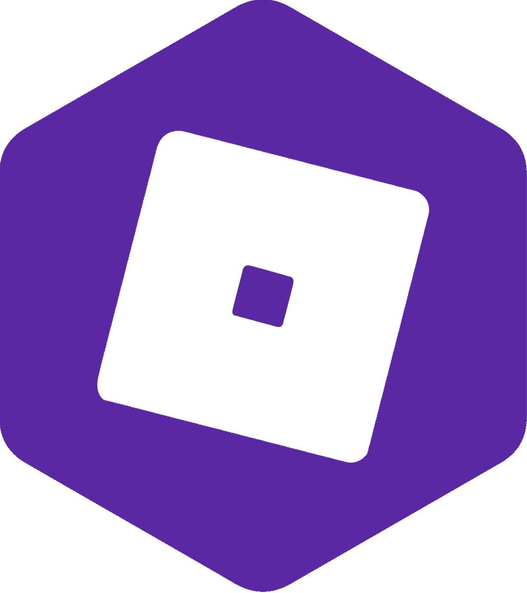

# Roblox-CS

<div align="center">
    
    <h3>C# to Luau Transpiler for Roblox</h3>
</div>

<div align="center">
    <a href="https://discord.gg/9QARU7cHyv"></a>
</div>

<br/>

**Roblox-CS** is a modern compiler that translates C# source code into idiomatic Luau. It allows you to write Roblox games using the strong typing, pattern matching, and async features of C# while running on the native Roblox engine.

## ✨ Key Features

- **Modern C# 9+ Support**: Uses Roslyn to support `async/await` (mapped to Promises), Pattern Matching, Switch Expressions, and Records.
- **Unity Migration Layer**: Native support for Unity API aliases (`GameObject`, `Debug.Log`, `Start`/`Update` lifecycle) to make porting games easier.
- **Robust CLI**: Integrated project scaffolding, file watching, and Rojo synchronization.
- **Smart Macros**: Zero-overhead macros for Luau specifics:
    - `idiv` for integer division.
    - `typeIs(obj, "type")` for `typeof()` checks.
    - `TS.iter` for efficient table iteration.
- **Runtime Library**: A lightweight runtime handling `System.Math`, Collections (`List`, `Dictionary`, `HashSet`), and Exception handling.

## 🚀 Getting Started

### 1. Installation
Download the latest release or build from source using the .NET SDK.

### 2. Create a Project
Use the CLI to scaffold a new project. You can use the built-in "Unity Roll-a-Ball" template to see how the Unity aliases work.

```bash
# Create a new project
roblox-cs new unity-roll-a-ball --name "MyGame" --verify
```

### 3. Build & Watch
Run the compiler in watch mode. This will transpile your code, start the Rojo server, and automatically rebuild on file changes.

```bash
roblox-cs --project ./MyGame --watch
```

**CLI Flags:**
- `--rojo-build`: Automatically runs `rojo build` after compilation to generate the `.rbxl` file.
- `--no-serve`: Disables the automatic Rojo server (useful for CI/CD).
- `--runtime-tests`: Runs internal Luau runtime tests using [Lune](https://github.com/lune-org/lune) to ensure correctness.

## ⚙️ Configuration

Configure your project via `roblox-cs.yml` in the project root:

```yaml
SourceFolder: src
OutputFolder: out
RojoProjectName: default
RojoServePort: 34872

# Enable Unity API compatibility layer (GameObject, Debug.Log, etc.)
EnableUnityAliases: true

# Compiler Macros & Optimization Toggles
Macro:
  EnableIteratorHelpers: true  # Enables TS.iter / TS.array_flatten optimization
  EnableMathMacros: true       # Maps System.Math directly to Luau math library
  EnableBit32Macros: true      # Maps bitwise operators to bit32 library
```

## 🧩 Architecture

Roblox-CS is currently transitioning to a **V2 Node-Based Architecture**:

1.  **Analysis**: The compiler builds a Semantic Model to resolve symbols, types, and references.
2.  **Transformation (V2)**: A pipeline of `Transformers` converts C# Syntax Nodes into a custom **Luau AST**.
    *   *Note: If the V2 pipeline encounters an unsupported edge case, it automatically falls back to the Legacy generator to ensure stability.*
3.  **Rendering**: The Luau AST is rendered into `.luau` source files, preserving indentation and formatting where possible.

## 🤝 Unity Migration Path

If you are moving from Unity, you don't need to rewrite everything immediately. Use the `UnityAliases` namespace:

```csharp
using UnityEngine; // Mapped via aliases

public class Player : MonoBehaviour 
{
    public void Start() 
    {
        var obj = new GameObject("Weapon");
        obj.transform.parent = this.transform;
        Debug.Log("Player started!");
    }
}
```

The transpiler maps these calls to their Roblox equivalents (`Instance.new`, `print`, `Parent` assignment).

## 📚 Diagnostics

The compiler emits custom diagnostics (prefixed with `ROBLOXCS`) to guide you away from C# patterns that are inefficient or impossible in Luau.

| Code | Description |
| :--- | :--- |
| **ROBLOXCS3018** | Await used inside a synchronous method (requires `async`). |
| **ROBLOXCS3020** | Async iterator methods (`yield` inside `async`) are not supported. |
| **ROBLOXCS3032** | Iterator helper (`TS.iter`) misuse or disabled configuration. |
| **ROBLOXCS3042** | `ref struct` declarations are not supported. |

## 🧪 Testing

We prioritize correctness. The project includes a `RuntimeSpecRunner` that executes transpiled C# code inside the **Lune** runtime to verify that logic (especially Async/Promise chains) behaves exactly as it does in .NET.

To run tests locally (requires Lune installed):
```bash
scripts/run-runtime-specs.sh
```

## License

This project is licensed under the BSD 3-Clause "New" or "Revised" License.